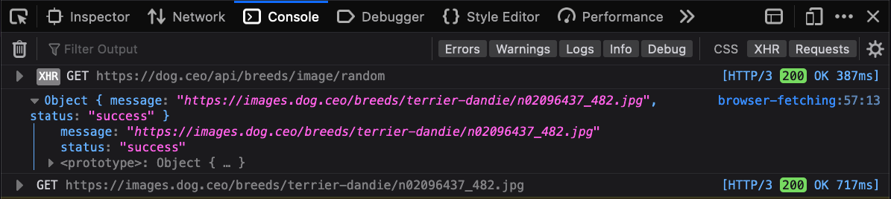

# Aren't you fetching?!

_I'm uncomfortable, you're probably uncomfortable, let's move on to fetching in the web browser_.

All modern web browsers supply a Fetch API for making a HTTP request to a web server, and handling the data returned from the server. The Fetch API provides a programming interface to asynchronously exchange data with a web server without needing to load another web page.

It's useful to web developers in scenarios such as:

* **Displaying dynamic data** that changes over time
  _For example, fetching current weather conditions for the given location_
* **Partially updating the page** in response to user interactivity
  _For example, fetching and displaying the current stock price for a user-provided stock index_
* **Submitting forms** and displaying a success or error messages without needing to reload an entire page.
  _For example, Adding an item to a shopping cart_

Fetch's interface only requires a single [argument](https://codeburst.io/parameters-arguments-in-javascript-eb1d8bd0ef04)—a `url` address to send the request to. The second argument is an [object](https://developer.mozilla.org/en-US/docs/Learn/JavaScript/Objects/Basics) for specifying various options.

```javascript
  fetch(url, options)
```
As with most asynchronous APIs in JavaScript, `fetch` returns a [Promise](https://developer.mozilla.org/en-US/docs/Web/JavaScript/Guide/Using_promises) that either resolves (succeeds) or rejects (fails) after receiving a response.

Below is a minimal example of using fetch to request a random dog image from [dog.ceo](https://dog.ceo). The image returned is then displayed in the page along with the full JSON response. 

If you'd like to see the HTTP requests sent during fetches in your browser, open the _Web Developer Tools_ in your browser (`Command`+`Option`+`i` on macOS, or `Control`+`Shift`+`i` on Windows/Linux) and select the _Console_ tab.


```javascript
const fetchDog = () => fetch('https://dog.ceo/api/breeds/image/random')
  // Resolve the JSON returned from the url
  .then(response => response.json())
  // Display the image and the raw JSON in the page
  .then(result => {
    console.log(result)
    // Get a reference to the dog image and update the image source
    const dogImage = document.querySelector('#dog')
    dogImage.src = result.message
    // Ges a reference to a the <pre> element and insert the fetch results inside. 
    const resultsElement = document.querySelector('#dog-results')
    resultsElement.innerHTML = JSON.stringify(result)
  })
  // Log any errors to the developer console
  .catch(error => console.error(error))
```

<script>
const fetchDog = () => fetch('https://dog.ceo/api/breeds/image/random')
  .then(response => response.json())
  .then(result => {
    console.log(result)
    document.querySelector('#dog').src = result.message
    document.querySelector('#dog-results').innerHTML = JSON.stringify(result, null, 2)
  })
  .catch(error => console.error(error))
</script>
<button onclick="fetchDog()">Call the `fetchDog` function</button>

#### JSON from the response:
<pre class="language-javascript" id="dog-results">Nothing fetched yet.</pre>

#### Image from the response:
<div style="width: 400px;">
  
</div>

The HTTP request to fetch the dog data is reflected in the _Network_ tab, and the data from the fetched response can be inspected in the Console panel. 
Below is an example of the data in the Web Developer tools.



## Summary

The previous example only hint at the capabilities of the Fetch API. Read the ["Using the Fetch API"](https://developer.mozilla.org/en-US/docs/Web/API/Fetch_API/Using_Fetch) page on the Mozilla Developer Network (MDN) for more comprehensive examples and detail on the Fetch API. Fetch isn't limited to web browsers—it's also available in [Node.js v18](https://nodejs.org/en/blog/announcements/v18-release-announce/#fetch-experimental) and can be used on the server.

Fetch is an essential API for any dynamic webpage that reacts to user interactivity. If you weren't fetching before, you sure are fetching now.
